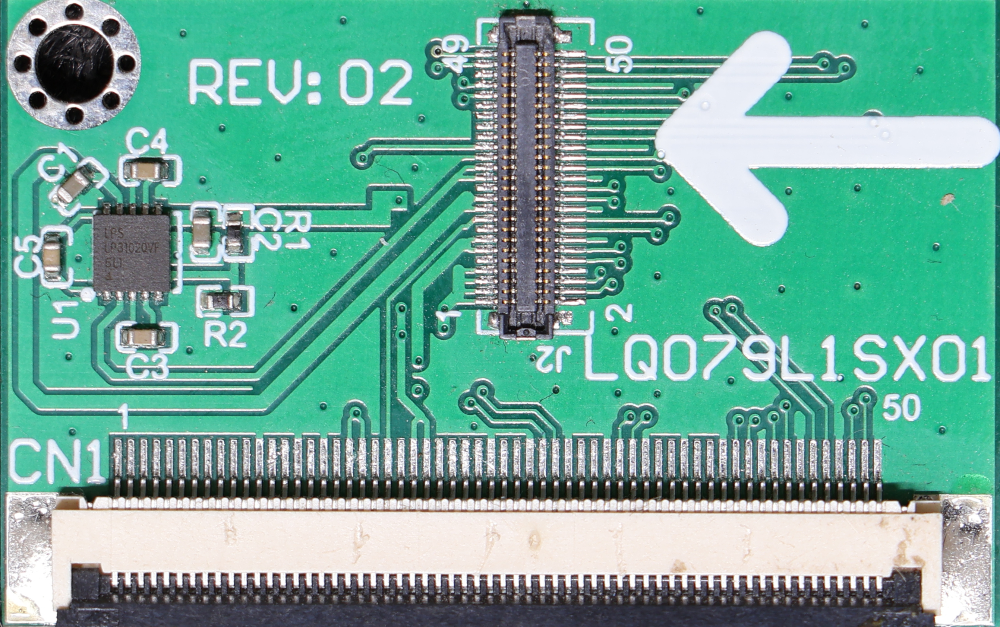
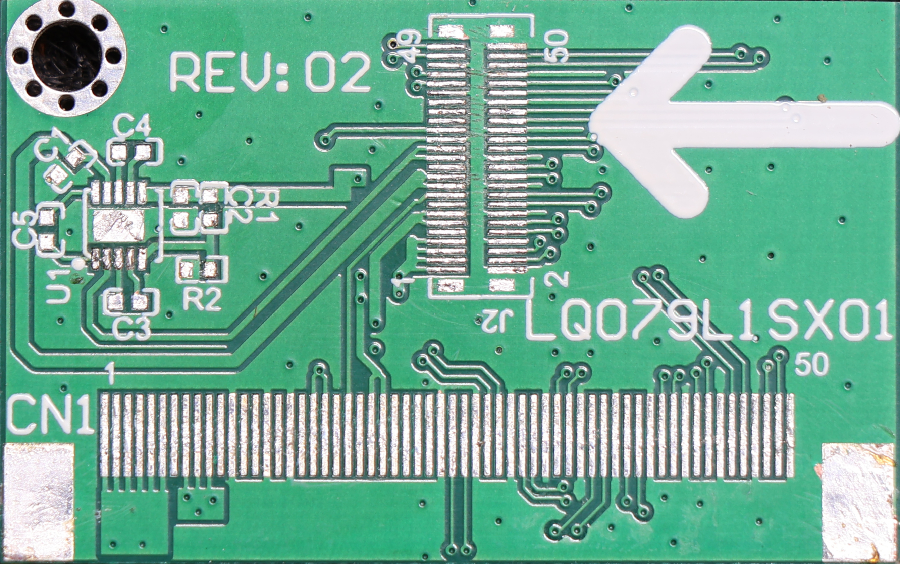
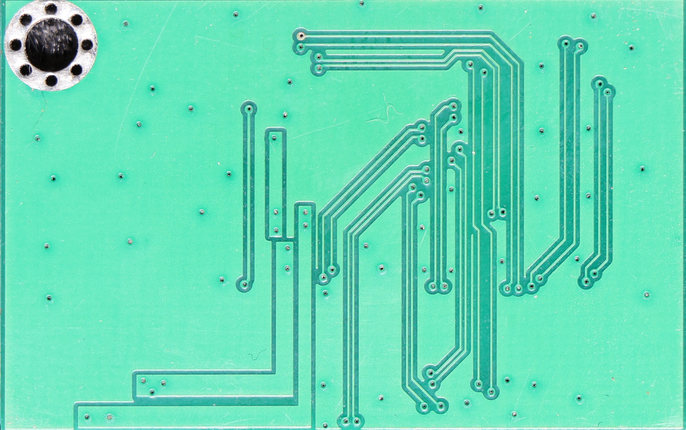

## LQ079L1SX01 driver board

### Note:
I have removed bunch of components prior to reverse engineering this particular board,
just to check if the STC microcontroller is needed (it did work without it somehow, 
but it is used for powerup sequencing). I have another board, so I will measure the 
components and include these in schematic (when necessary)

### Main driver board:

### Interconnect board:

### Schematic:

### Powerup sequence:
#### LT6911C
requires 3.3V rail to raise first, then 1.2V after at least 1ms, finally, reset
is released after at least 1ms. 

3.3V and 1.2V regulators are not sequenced. Reset pin has RC network.
LT6911C emits 3.3V pulse on GPIO5 presumably after reset is released. Presumably after
HDMI communication is established, GPIO 5 emits ~900ms pulse.

#### LQ079L1SX01
requires 1.8V first, 5.6V after 10ms, -5.6V after 10ms, release reset after
20ms, set reset after 10ms, release reset after 10ms, finally 30ms delay before sending
commands.

This sequence is not followed on this board. 1.8V buck converter starts immediately.
Real voltage is above 1.9V. +/-5.6V is generated on small interconnect board.

The reset sequencing is kinda sorta followed, however I am not sure who designed it.
Initial L->H->L pulse is generated by STC chip by enabling and disabling buck converter
for about 30ms.

Then after 2s from time when first pulse is generated, 1.8V rails goes high. This forms
leading edge of second reset pulse. Falling edge is caused by GPIO5 falling down, which
causes Q4 to conduct pulling the rail down.

However reset is active low, so WTF? Well the reset line does not actually go quite down
to 0V. Because Q4 is P channel mosfet, at around 1.2V its resistance will be quite high.
1.2V is out of spec with H or L level for this line.

Finally, there is also Q6, which is able to pull reset line low, when LT6911 does stuff 
with HDMI HPD line, Gate of Q6 is held at ~650mV, which means it is somewhat conducting.
This pulls the line down to about 00mV for the first pulse, and 1.2V for the second
pulse. When GPIO5 goes down, the Therefore line will be held at about 900mV, which is
again out of spec with either H or L level.

Also If I am to follow this powerup sequence from beginning, The first pulse means 
nothing, because whole 1.8V line goes down!

I had some issues with this board, now I think I know why...
